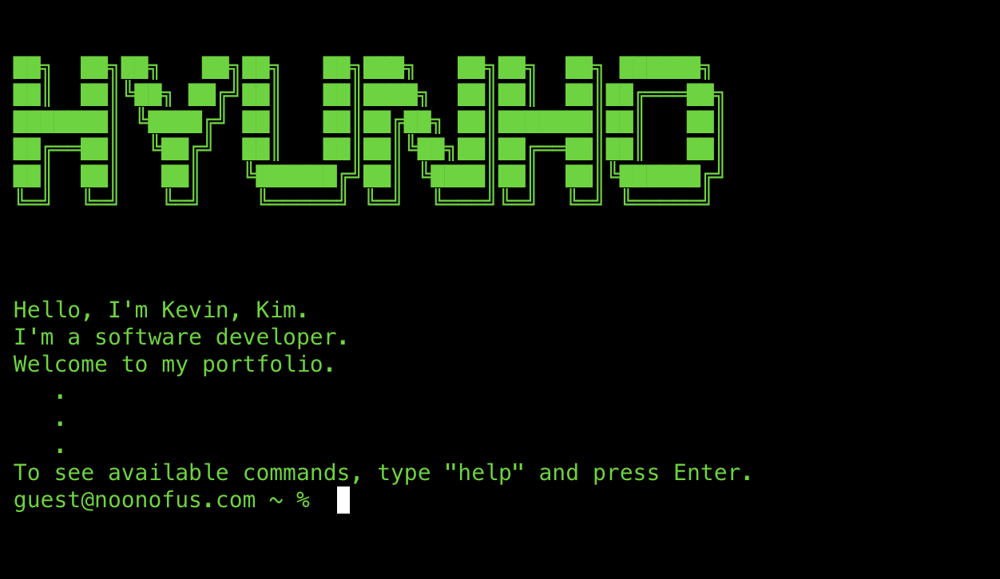

# My personal website: Terminal/OS style portfolio
[](./LICENSE)  


## 🌐 Demo  
🔗 **Live Website:** [Go to Website](https://hyunho.vercel.app/)

## 📜 Description  
This project is a portfolio website designed with a terminal and OS-style interface. It was developed using **Next.js, React, React-Redux, and Tailwind CSS**, along with libraries such as **xterm.js, Chakra UI, and Framer Motion**.  

### 🚀 **Planned Features**  
- Add OS-like built-in applications (e.g., web browser, file manager)  
- Improve animations and window management  
- Implement more customizable themes  

## 📸 Screenshots  



## 🛠️ Tech Stack  
- **Frontend:** Next.js, React, TypeScript, Tailwind CSS
- **State Management:** Redux Toolkit
- **UI Libraries:** Chakra UI, framer-motion
- **Terminal Emulator:** xterm.js

## 📦 Installation  
```bash
# Clone this repository
git clone https://github.com/BCITKevin/Portfolio-terminal-OS.git

# Change directory
cd Portfolio-terminal-OS

# Install dependencies
npm install

# Start the server
npm run dev
```

## License
This project is licensed under the MIT License - see the [LICENSE](./LICENSE) file for details.


