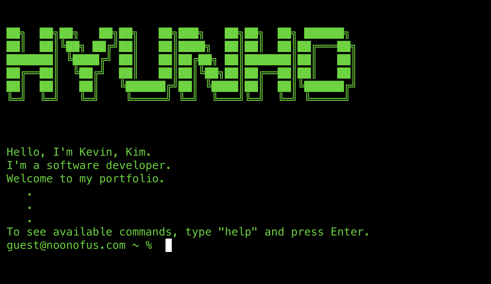

# My personal website: Terminal/OS style portfolio
[](./LICENSE)  


## 🌐 Demo  
🔗 **Live Website:** [Go to Website](https://hyunho.vercel.app/)

## 📜 Description  
This project is a bilingual portfolio with two entries: an xterm-powered
terminal at `/` and an OS-style GUI at `/gui`. The GUI provides shareable
app/language URLs, independent project windows, an HTML résumé with print
support, Settings, keyboard window switching, responsive layouts, and
resource-aware terminal/media lifecycle management.

### 🚀 **Planned Features**
- Add OS-like built-in applications (e.g., web browser, file manager)  
- Add SEO-focused project and résumé routes
- Migrate rollback-only legacy content consumers to the portfolio content model

## 📸 Screenshots  



## 🛠️ Tech Stack  
- **Frontend:** Next.js, React, TypeScript, Tailwind CSS
- **State Management:** Zustand
- **UI Libraries:** Framer Motion, Radix UI primitives, next-themes
- **Terminal Emulator:** xterm.js

## ✅ Verification Gates

Run these commands before treating a refactor as complete:

```bash
npm test
npm run lint
npx tsc --noEmit --pretty false
npm run build
npm run test:e2e
npm run test:e2e:release
```

Recommended order:

1. `npm test`
2. `npm run lint`
3. `npx tsc --noEmit --pretty false`
4. `npm run build`

Current meaning of each gate:

- `npm test`: runs core unit tests with Vitest
- `npm run lint`: runs ESLint with the Next.js 16 flat config baseline
- `npx tsc --noEmit --pretty false`: runs standalone TypeScript validation
- `npm run build`: runs the production build including Next.js TypeScript validation
- `npm run test:e2e`: runs Chromium critical GUI coverage
- `npm run test:e2e:release`: runs Chromium, Firefox, and WebKit release coverage

## 📦 Installation  
```bash
# Clone this repository
git clone https://github.com/BCITKevin/Portfolio-terminal-OS.git

# Change directory
cd Portfolio-terminal-OS

# Install dependencies
npm install

# Start the server
npm run dev
```

## 🧪 Local Commands

```bash
npm run dev
npm test
npm run lint
npx tsc --noEmit --pretty false
npm run build
npm run test:e2e
npm run test:e2e:release
```

## License
This project is licensed under the MIT License - see the [LICENSE](./LICENSE) file for details.


