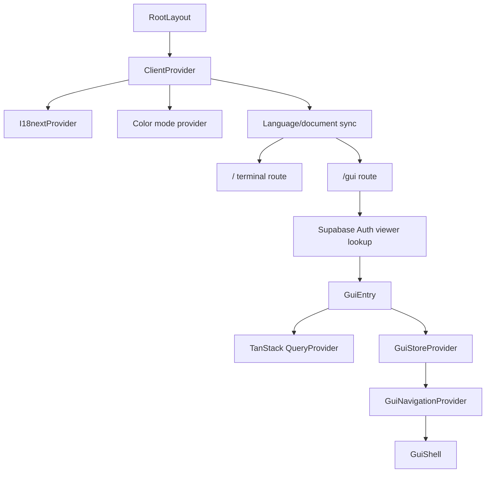
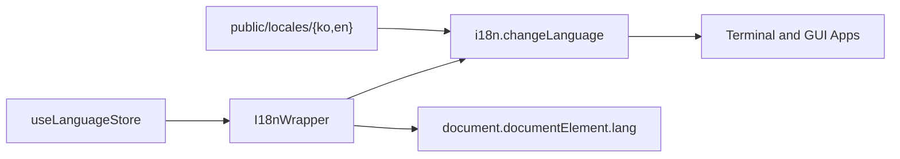
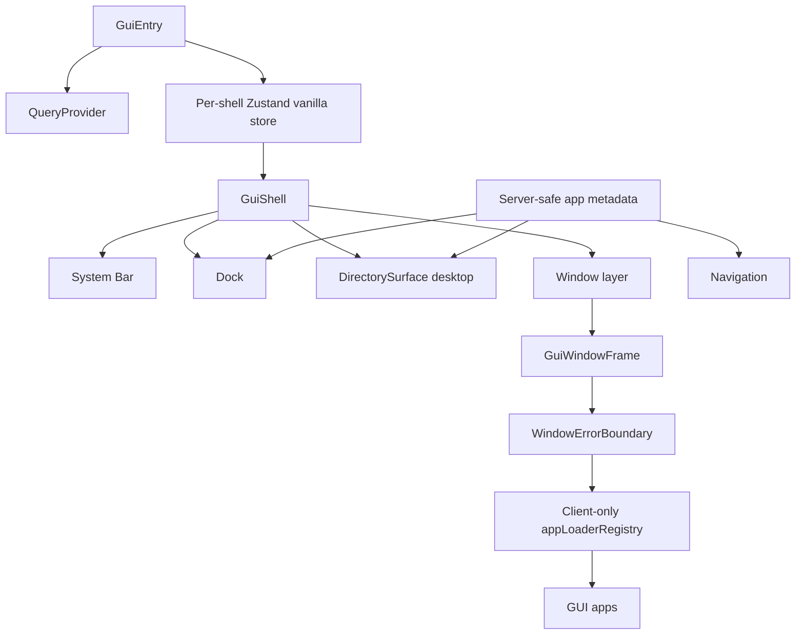
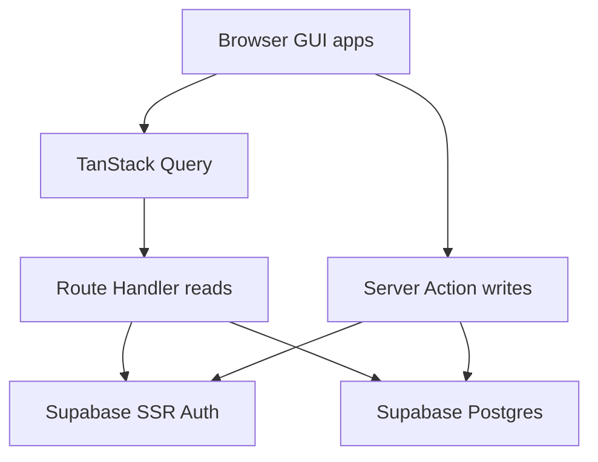

# Portfolio-terminal-OS Architecture

> 최종 업데이트: 2026-07-09

## Overview

Portfolio-terminal-OS is a Next.js App Router application with two primary experiences:

- `/`: an xterm-based terminal portfolio
- `/gui`: an OS-style desktop portfolio

The application is bilingual, authentication-aware, and backed by Supabase for
GitHub login, guestbook notes, and the wallpaper catalog. GUI preferences are
local browser state.

## Current runtime



### Route layer

- `src/app/page.tsx` renders the terminal route.
- `src/app/gui/page.tsx` reads the current Supabase user on the server and passes a serializable viewer into `GuiEntry`.
- `src/app/layout.tsx` loads Pretendard, global styles, xterm styles, metadata, and `ClientProvider`.
- API routes under `src/app/api/*` provide read endpoints and account lifecycle operations.
- Server Actions provide in-app authenticated mutations for notes.

## Internationalization



The GUI URL can carry language state, but the active language is still owned by
the shared language store and synchronized to i18next and `<html lang>`.

## GUI runtime



### Dependency rules

```txt
shared/content/portfolio  ← GUI apps and Resume
appCatalog/appMetadata    ← URL parser, directory tree, Dock, navigation planner
appLoaderRegistry         → app metadata
browserHistoryAdapter     → pure navigation planner
GUI apps                  → shared UI/content/i18n/query helpers
```

### State rules

- A GUI store is created through `zustand/vanilla` for each mounted shell and supplied through React Context.
- `WorkspaceFocus` is a discriminated union for either desktop mode or an active window.
- Normal apps are singletons by app ID; project apps are singletons by project slug.
- Window visibility and page visibility are independent. Effective resource activity is derived from both.
- The URL restores active view and language, not the complete workspace.
- Theme, Dock auto-hide, wallpaper, and viewer state are surfaced through the GUI store.
- Language, Dock auto-hide, and wallpaper selection are persisted in `gui:preferences` localStorage.
- Theme is persisted by the shared color-mode provider.
- Server state is held in TanStack Query, not in the GUI Zustand store.

### App registry rules

- `app.config.ts` files are server-safe metadata and must use `defineAppConfig()`.
- `app.loader.tsx` files are client-only dynamic loaders.
- Catalog and loader key sets must match through mapped types and unit tests.
- URL values select allowlisted app IDs and project slugs. They never become dynamic import paths.
- Folder apps render through `DirectorySurface`; they do not define custom folder renderers.

### Navigation rules

- `planNavigation()` is a pure deterministic function.
- The browser adapter is the only layer that performs History API effects.
- User-selected active views push history; derived close/minimize/canonicalization changes replace or traverse according to history provenance.
- Pending back traversal uses sequence IDs, timeout fallback, bounded/coalesced events, and stale-popstate rejection.

## Auth, data, and server state



### Supabase responsibilities

- Supabase Auth handles GitHub OAuth sessions.
- Supabase Postgres stores `user_accounts`, `notes`, and `wallpapers`.
- The old `user_preferences` table remains in migrations but is not on the current GUI critical path.
- The browser does not directly mutate private tables.
- Public DTOs avoid exposing internal account identifiers where they are not required.

### Notes

- Guest users can read notes through `GET /api/notes`.
- If no Supabase auth cookie exists, the notes read path skips viewer resolution and performs a guest list query.
- Authenticated writes go through Server Actions.
- Note mutation actions re-check the current user server-side.
- React Query owns notes list cache and invalidation.

### GUI preferences

- Settings reads the wallpaper catalog through a query hook.
- Preference changes update Zustand/color-mode immediately.
- Language, Dock auto-hide, and wallpaper selection persist to localStorage through `GuiNavigationProvider`.
- Theme persists to localStorage through the shared color-mode provider.
- No preference save waits for Supabase.

### GUI icons and image loading

- GUI runtime icons use small files under `public/icons/optimized`.
- Dock/Desktop icon rendering bypasses Next Image optimization for these local tiny assets.
- Original high-resolution icons remain available for non-runtime or detail-app use cases.

## Delivery status

1. Terminal and GUI routes are active.
2. Typed catalog/loader boundaries and the pure navigation planner are active.
3. About, Projects, Resume, Terminal, Contact, Guestbook, and Settings apps are active under `/gui`.
4. GitHub OAuth, Notes, server-backed wallpapers, and local GUI preferences are integrated.
5. React Query is the client server-state layer for notes and wallpapers.
6. GUI icon loading and guest notes reads have been optimized for the current Vercel/Supabase deployment shape.

## Verification

Minimum code-task checks:

```bash
npm run validate:app-structure
npm run lint
npx tsc --noEmit --pretty false
npm test
npm run build
```

Extended browser coverage:

```bash
npm run test:e2e
npm run test:e2e:release
```

GUI-specific coverage includes:

- compile-time app ID/params/component correlation fixtures
- catalog/loader key equality tests
- pure navigation planner unit/property tests
- app directory structure validation
- critical Chromium E2E coverage
- optional release coverage across Chromium, Firefox, and WebKit
