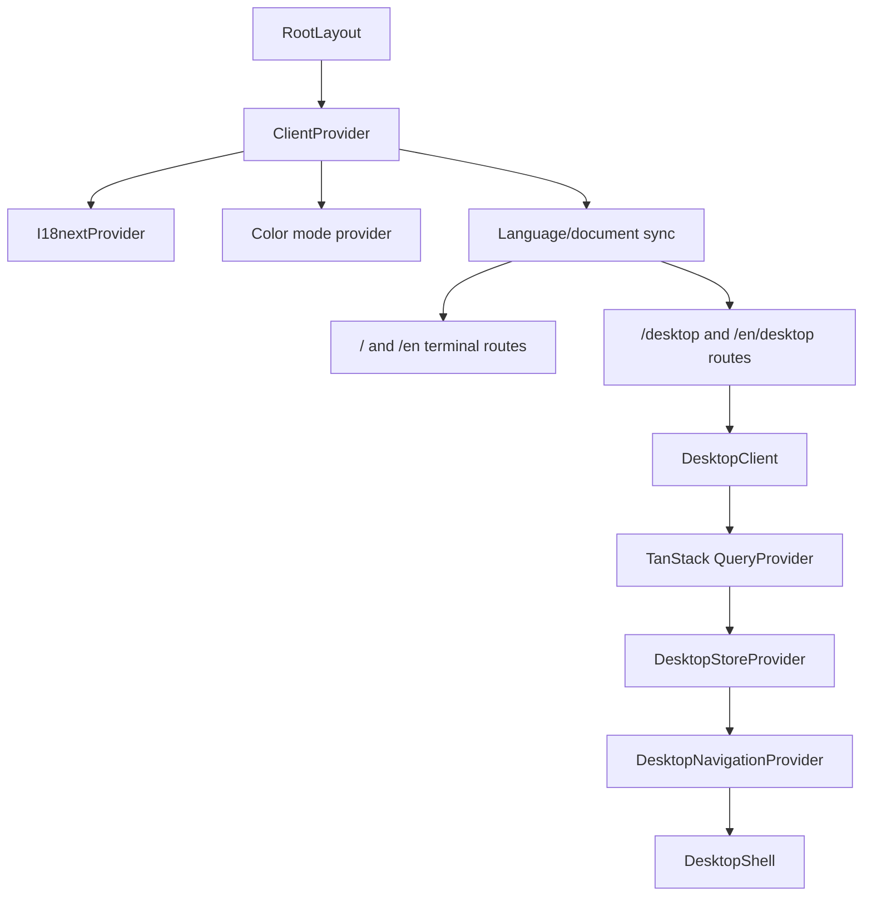
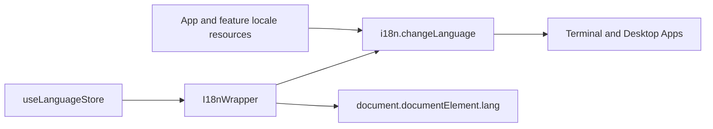
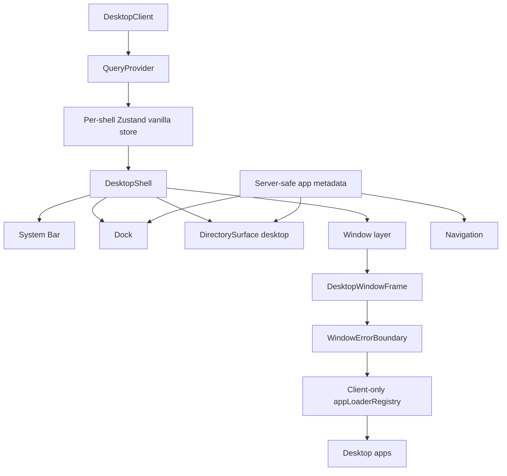
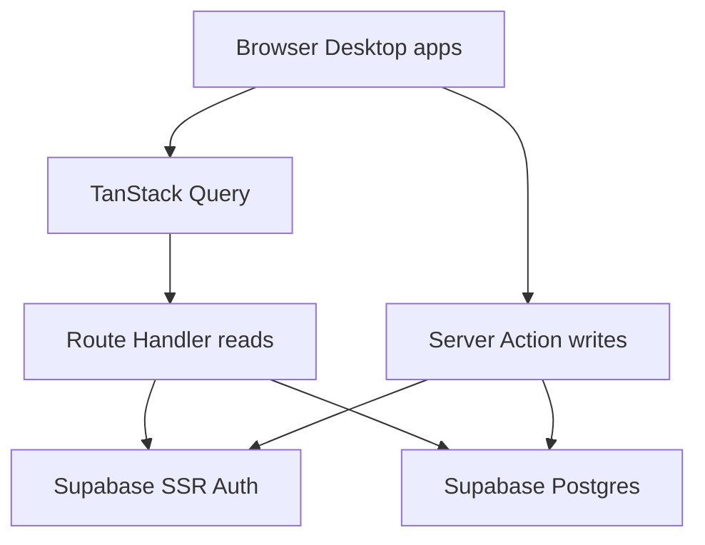

# Portfolio-terminal-OS Architecture

> 최종 업데이트: 2026-09-21

## Overview

Portfolio-terminal-OS is a Next.js App Router application with two primary experiences:

- `/`: a Korean xterm-based terminal portfolio
- `/desktop`: a Korean OS-style desktop portfolio
- `/en` and `/en/desktop`: fixed English entry points for direct sharing and SEO

The application is bilingual, authentication-aware, and backed by Supabase for
GitHub login, guestbook notes, and the wallpaper catalog. Desktop preferences are
local browser state.

## Current runtime


```mermaid
flowchart TD
    RootLayout["RootLayout"] --> ClientProvider["ClientProvider"]
    ClientProvider --> I18next["I18nextProvider"]
    ClientProvider --> ColorMode["Color mode provider"]
    ClientProvider --> I18nWrapper["Language/document sync"]

    I18nWrapper --> TerminalRoute["/ and /en terminal routes"]
    I18nWrapper --> DesktopRoute["/desktop and /en/desktop routes"]

    DesktopRoute --> DesktopClient["DesktopClient"]
    DesktopClient --> QueryProvider["TanStack QueryProvider"]
    QueryProvider --> StoreProvider["DesktopStoreProvider"]
    StoreProvider --> NavigationProvider["DesktopNavigationProvider"]
    NavigationProvider --> DesktopShell["DesktopShell"]
```

### Route layer

- `src/app/page.tsx` renders the terminal route.
- `src/app/desktop/page.tsx` renders `DesktopClient`; `useViewerBootstrap` loads the viewer through `/api/auth/viewer` after the shell mounts.
- Requests to `/gui` and `/en/gui` receive permanent redirects to the corresponding Desktop routes, with query parameters preserved.
- `src/app/layout.tsx` loads Pretendard, global styles, xterm styles, metadata, and `ClientProvider`.
- API routes under `src/app/api/*` provide read endpoints and account lifecycle operations.
- Server Actions provide in-app authenticated mutations for notes.

## Internationalization


```mermaid
flowchart LR
    LanguageStore["useLanguageStore"] --> I18nWrapper
    I18nWrapper --> I18next["i18n.changeLanguage"]
    I18nWrapper --> HtmlLang["document.documentElement.lang"]
    LocaleJSON["App and feature locale resources"] --> I18next
    I18next --> Apps["Terminal and Desktop Apps"]
```

The Desktop URL can carry language state, but the active language is still owned by
the shared language store and synchronized to i18next and `<html lang>`.
The `/en` and `/en/desktop` routes initialize English from the route and serialize
Desktop navigation under the `/en/desktop` path. Legacy `?lang=en` Desktop URLs are
canonicalized to that fixed English path. Each language route publishes a
canonical URL and a reciprocal `hreflang` alternate.
`src/app/i18n/index.ts` composes shell resources from `src/app/i18n/resources`
and feature resources from each feature. Portfolio project content is assembled
from allowlisted localized resources by `getPortfolioContent.ts` and
`projectManifest.ts`.

`src/app/robots.ts` excludes API and authentication paths from crawlers,
`src/app/sitemap.ts` lists the four public entry points, and
`src/app/auth/auth-error/page.tsx` is marked `noindex, nofollow`.

## Desktop runtime


```mermaid
flowchart TD
    DesktopClient --> QueryProvider
    QueryProvider --> StoreProvider["Per-shell Zustand vanilla store"]
    StoreProvider --> Shell["DesktopShell"]
    Shell --> SystemBar["System Bar"]
    Shell --> Dock["Dock"]
    Shell --> Desktop["DirectorySurface desktop"]
    Shell --> WindowLayer["Window layer"]
    WindowLayer --> WindowFrame["DesktopWindowFrame"]
    WindowFrame --> Boundary["WindowErrorBoundary"]
    Boundary --> LoaderRegistry["Client-only appLoaderRegistry"]

    Catalog["Server-safe app metadata"] --> Desktop
    Catalog --> Dock
    Catalog --> Navigation
    LoaderRegistry --> Apps["Desktop apps"]
```

### Dependency rules

```txt
app/desktop → features → components/lib foundations

appCatalog      → URL parser, directory tree, Dock, navigation planner
appLoaderRegistry → feature apps and Desktop adapters
DesktopNavigationProvider → pure navigation planner and browser History API
features        ✕ app and other feature internals
```

### Style ownership

- `src/app/globals.css` owns site-wide reset and design tokens.
- `src/app/desktop/styles/application.css` owns shared OS application chrome,
  `.application-*` selectors, and `--application-*` tokens.
- App-specific presentation stays co-located in CSS Modules, including Notes and
  project reading content. This keeps shared shell changes separate from app
  content styling.

### State rules

- A Desktop store is created through `zustand/vanilla` for each mounted shell and supplied through React Context.
- `WorkspaceFocus` is a discriminated union for either desktop mode or an active window.
- Normal apps are singletons by app ID; project apps are singletons by project slug.
- Window visibility and page visibility are independent. Effective resource activity is derived from both.
- The URL restores active view and language, not the complete workspace.
- Theme, Dock auto-hide, wallpaper, and viewer state are surfaced through the Desktop store.
- Language, Dock auto-hide, and wallpaper selection are persisted in `desktop:preferences` localStorage.
- Theme is persisted by the shared color-mode provider.
- Server state is held in TanStack Query, not in the Desktop Zustand store.

### App catalog and loader rules

- `src/app/desktop/config/appCatalog.ts` is the server-safe metadata source.
- `src/app/desktop/lib/appLoaderRegistry.tsx` is the client-only dynamic loader map; Terminal keeps `ssr: false`.
- Catalog and loader key sets must match through mapped types, structural validation, and unit tests.
- URL values select allowlisted app IDs and project slugs. They never become dynamic import paths.
- Folder apps render through `DirectorySurface`; they do not define custom folder renderers.
- Project metadata such as stack badges and visibility is centralized in
  `src/features/portfolio/content/projectManifest.ts`; the Desktop catalog
  retains only typed runtime metadata.
- Project detail apps compose the shared `ProjectCaseStudyPage`; architecture
  sections use either reviewed static content or client-rendered
  `ProjectArchitectureDiagram` charts with Mermaid strict security mode.

### Navigation rules

- `planNavigation()` is a pure deterministic function.
- The browser adapter is the only layer that performs History API effects.
- User-selected active views push history; derived close/minimize/canonicalization changes replace or traverse according to history provenance.
- Pending back traversal uses sequence IDs, timeout fallback, bounded/coalesced events, and stale-popstate rejection.

## Auth, data, and server state


```mermaid
flowchart TD
    Browser["Browser Desktop apps"] --> Query["TanStack Query"]
    Query --> Reads["Route Handler reads"]
    Browser --> Actions["Server Action writes"]
    Reads --> SupabaseAuth["Supabase SSR Auth"]
    Actions --> SupabaseAuth
    Reads --> SupabaseDB["Supabase Postgres"]
    Actions --> SupabaseDB
```

### Supabase responsibilities

- Supabase Auth handles GitHub OAuth sessions.
- Supabase Postgres stores `user_accounts`, `notes`, and `wallpapers`.
- The old `user_preferences` table remains in migrations but is not on the current Desktop critical path.
- The browser does not directly mutate private tables.
- Public DTOs avoid exposing internal account identifiers where they are not required.

### Notes

- Guest users can read notes through `GET /api/notes`.
- If no Supabase auth cookie exists, the notes read path skips viewer resolution and performs a guest list query.
- Authenticated writes go through Server Actions.
- Note mutation actions re-check the current user server-side.
- React Query owns notes list cache and invalidation.
- The Guestbook dynamic app fallback and the mounted notes query state share the feature-owned `GuestbookShell` and localized status component, preventing a layout jump between loading phases.

### Desktop preferences

- Settings reads the wallpaper catalog through a query hook.
- Preference changes update Zustand/color-mode immediately.
- Language, Dock auto-hide, and wallpaper selection persist to localStorage through `DesktopNavigationProvider`.
- New writes use `desktop:preferences`; reads temporarily accept the legacy `gui:preferences` key so existing user preferences survive the route migration.
- Theme persists to localStorage through the shared color-mode provider.
- No preference save waits for Supabase.

### Desktop icons and image loading

- Desktop runtime icons use small files under `public/icons/optimized`.
- Dock/Desktop icon rendering bypasses Next Image optimization for these local tiny assets.
- Original high-resolution icons remain available for non-runtime or detail-app use cases.
- Portfolio technology icons use 96px PNG sources with Next Image sizing at their 32px and 16px display sizes.
- Project detail stacks come from the centralized portfolio manifest, with each mapped badge rendered through the shared Next Image component.
- The shell wallpaper uses a responsive Next Image source, and Settings uses dedicated 360px wallpaper previews.

## Delivery status

1. Terminal and Desktop routes are active.
2. Typed catalog/loader boundaries and the pure navigation planner are active.
3. About, Projects, Resume, Terminal, Contact, Guestbook, and Settings apps are active under `/desktop`; legacy GUI URLs redirect to the same Desktop state.
4. Projects exposes seven allowlisted case-study apps, including MCP and Voice Gateway, with bilingual content and architecture diagrams.
5. GitHub OAuth, Notes, server-backed wallpapers, and local Desktop preferences are integrated.
6. React Query is the client server-state layer for notes and wallpapers.
7. Desktop icon loading and guest notes reads have been optimized for the current Vercel/Supabase deployment shape.

## Verification

Minimum code-task checks:

```bash
npm run validate:app-structure
npm run lint
npx tsc --noEmit --pretty false
npm test
npm run build
```

Extended browser coverage:

```bash
npm run test:e2e
npm run test:e2e:release
```

Desktop-specific coverage includes:

- compile-time app ID/params/component correlation fixtures
- catalog/loader key equality tests
- pure navigation planner unit/property tests
- app directory structure validation
- critical Chromium E2E coverage
- optional release coverage across Chromium, Firefox, and WebKit
